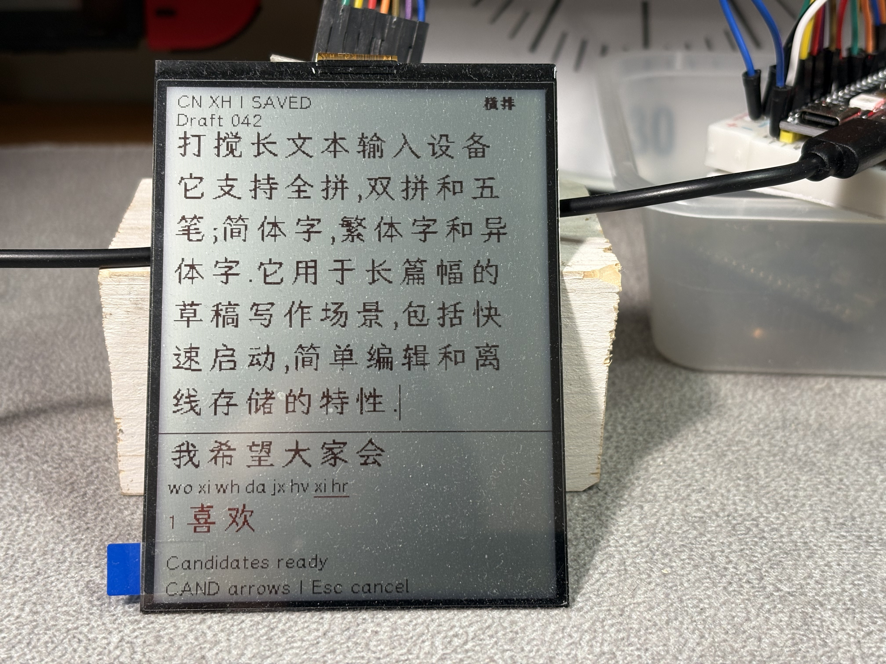

# Draftor 草稿机

**A distraction-free local pocket text recording device** 
一台无打搅本地口袋文本记录设备

---

## Current Status / 当前状态

### MCU Support / 单片机支持

- ESP32-S3 N16R8
- Raspberry Pi Pico 2 W

### Display Support / 屏幕支持

- [Osptek ST7306 black-white-red reflective TFT display](display/st7306/)

### Input Support / 输入支持

- Quanpin (Full Pinyin) — 全拼
- Shuangpin (Double Pinyin) — 双拼
- Wubi (Five-Stroke) — 五笔
- English direct input — 英文

---

## WHAT IS DRAFTOR? / 草稿机是什么？

Draftor is a distraction-free local text input and recording device — a “typewriter” built around an MCU (Microcontroller Unit) and used with a Bluetooth keyboard. 
一个无打搅本地文本记录设备，一台基于单片机的无线蓝牙「打字机」。

By “distraction-free”, I mean offline, no AI, and limited editing features. 
「无打搅」的意思是离线，无 AI，无复杂编辑功能。

It provides offline text storage and transfer without relying on cloud text services. 
它提供离线文本保存和传输，**不依赖云端**文本服务。

---

## WHAT DOES DRAFTOR SUPPORT? / 草稿机支持什么？

Draftor currently supports English direct input and three Chinese input methods: Quanpin (Full Pinyin), Shuangpin (Double Pinyin), and Wubi (Five-Stroke). 
草稿机目前提供英文和全拼、双拼、五笔三种中文输入法。

It supports Simplified Chinese, Traditional Chinese, and variant Chinese characters, with corresponding font resources. 
目前支持简体字、繁体字、异体字输出，并提供相应字库资源。

It is compatible with standard English-layout keyboards for macOS and Windows. 
兼容 macOS 和 Windows 标准英文键盘。

It currently supports both the Raspberry Pi Pico 2 W and the ESP32-S3 N16R8. The former is the Thin version, while the latter is the Thick version. The Thin version is a simpler and more focused typing and recording platform. The Thick version provides more functions and therefore comes with more distractions. 
目前兼容 Raspberry Pi Pico 2 W 与 ESP32-S3 N16R8 单片机。前者为 Thin 版本，更纯粹的打字平台；后者是 Thick 版本，功能更多但诱惑更多。

Draftor currently supports the Osptek ST7306 black-white-red reflective TFT display. Its display driver has been adjusted from the official driver to make it more suitable for displaying text. 
草稿机目前使用鱼鹰 ST7306 黑白红三色 TFT 反射屏，驱动模块基于官方驱动调校，适合文本展示。

---

## WHY DO WE NEED A DISTRACTION-FREE TEXT RECORDING DEVICE? / 为什么需要无打搅记录设备？

Many people, including me, are easily distracted. 
很多人（包括我自己）容易分心。

The personal reasons for distraction are complex and cannot simply be reduced to “you are a useless guy.” Someone might be troubled by anxiety, PTSD, depression, or ADHD; someone else might simply be affected by an occasional low mood that occurs in summer. 
分心的个体原因挺复杂的，不是简单的「你这个人就是不行」可以概括。有些人长期陷于焦虑、抑郁或者注意力缺失的困境；有些人则时不时遭受夏日小情绪的困扰。

More importantly, there are too many things that distract us: WhatsApp, WeChat, email, social media, shopping websites, and god damn TikTok. 
更糟糕的是，很多东西让人分心。微信、WhatsApp、邮件、社交媒体、购物网站，以及该死的钉钉和抖音。

Writing can be a form of self-healing. It helps us rethink our behaviour and clear our minds. This is a process we have to do ourselves. Reading, studying, working, creating, and speaking cannot completely replace writing. 
写作是一种自愈的方法，它帮助人审视自己的行为，整理自己的想法。这个过程必须由自己完成。阅读、学习、工作、创作、闲聊，都无法完全替代写作。

Writing is also a way of learning and thinking through haptic feedback. 
写作还是一种通过触觉反馈学习和思考的方法。

We have to accept the limits imposed by millions of years of biological evolution. For many people, deep thinking is difficult to separate from tactile experience, even if they may not realize it. Even copying things out by hand better matches some people’s memory habits, including mine. 
我们不得不接受百万年生物演化的限制。有很多人无法脱离触觉完成深度认知过程，即便他们没意识到这一点。甚至抄写更符合一些人（包括我）的记忆习惯。

Friction is not always a bad thing. 
摩擦不一定是坏事。

I really enjoy the friction of an HB pencil on paper when I write in my notebook. It often makes me write a little more — authentic nonsense, handmade. 
我非常享受 HB 铅笔在纸面摩擦的反馈。它常常让我不由自主多记几笔（正宗废话，手工制造）。

Many people still prefer to do their own writing. 
很多人依然喜欢自己写作。

AI can indeed simulate a specific writing style extremely well, but that is not the same as personal expression. Writing experience can be digitized, but it is difficult to make it personal without lived experience in the real world. 
当今的 AI 确实可以完美模拟出具体的风格，但那不是个性的表达。写作经验可以被数据化，但很难脱离现实经验被个性化。

If you work with text — for example, as a novelist or an anthropologist — it may be easier to appreciate this. 
如果你是文本工作者，譬如文学创作者和人类学学者，可能更容易体会到这一点。

---

## WHY CHOOSE DRAFTOR? / 为什么选择草稿机？

### Because it supports Chinese input / 因为它有中文输入

WriterDeck is already a relatively established category of portable, distraction-free text recording devices in markets dominated by Latin-alphabet languages. Electronic typewriters with displays have existed for nearly half a century. 
WriterDeck（书写板？我不知道该怎么翻译了）是拉丁语系市场相对固定的离线便携文本记录产品品类，带液晶屏的打字机也快有半个世纪的历史。

However, most WriterDecks and thermal typewriters do not support Chinese input. 
但是大多数 WriterDeck 和热敏打字机不兼容中文。

Devices such as the AlphaSmart, Freewrite, Brother EP-22, and Canon TypeStar 5 were not designed around Chinese input. Sharp, Casio, and other manufacturers did produce word processors capable of handling Chinese, but their Chinese input methods no longer match contemporary input habits. 
那些知名的记录设备不是按照中文输入设计的，譬如 AlphaSmart、Freewrite、兄弟 EP-22 和佳能 TypeStar 5。而像夏普、卡西欧在 1980s 前后推出的中文处理器，它们的中文输入方式已经不符合今天的中文输入习惯。

Some require character-by-character input, which is very different from how people normally use modern Chinese input methods. 
有的设备只支持单个汉字的输入方式，这几乎已经被淘汰了。

### Because it is designed for long-form text / 因为它为长文本输入设计

Chinese PDAs were personal digital terminals, not dedicated long-form writing devices. 
中文掌上电脑（譬如曾经的商务通）是个人数据终端，而非长文本写作设备。

Popular e-readers such as Kindle and iReader are designed primarily for reading, not writing. 
当下流行的 Kindle、掌阅之类的电纸书也是为了阅读而非写作设计的。

Some of these devices have awkward input interfaces, while others cannot provide the fast candidate response that Chinese input requires. 
有些设备的文本输入交互设计得相当诡异，有些则受限于低刷新率的屏幕，达不到中文候选词的高速要求。

Friction is not always a bad thing, but it is not necessarily a good thing either. 
摩擦不总是坏事，但也不一定是好事。

### Old equipment comes with other costs / 老设备有其他成本

Old laptops, tablets, mobile phones, and Chinese word processors can be very good for text input and editing, provided that you can accept their limitations: weight, battery life, file transfer, and other practical restrictions. 
老笔记本电脑、老平板、老手机、老中文处理机在中文输入和编辑上，都很好，但前提是你得接受它们的重量、续航和其他限制。

I like the fold-out keyboard on the Nokia 6822, for example, but its screen is too small and, for my purposes, it lacks usable Wi-Fi, Bluetooth file transfer, and a practical USB interface. 
我喜欢 Nokia 6822 的折叠键盘，但它屏幕太小，没有可用的 Wi-Fi 功能和蓝牙文件传输功能。

### Functions are distractions / 功能即干扰

Many of the devices mentioned above run Linux, OS X, Windows, iOS, BBOS, Symbian OS, or other operating systems. 
上述提到的很多设备，基于 Linux、OS X、Windows、iOS、BBOS、Symbian OS 或者其他操作系统研发。

They have many functions. Some can even run video games. 
它们功能繁复，自带游戏。

Those functions are potential sources of distraction. 
成为潜在的干扰源。

For someone who can spend five minutes playing with a toggle switch, those functions are enough to kill writing. 
对一个切换按钮都能玩 5 分钟的人来说，这些功能足以杀死写作。

### Cost matters too / 成本高昂

Here, by “cost”, I also mean the time and effort required to modify and adapt equipment. 
这里说的成本，包括了改造和适应旧设备的时间成本。

Some classic devices are now expensive collectibles rather than practical tools. 
某些经典型号可能价格昂贵，它们按收藏品销售，而不是以老工具定价。

### Faster than handwriting / 比手写快

I make my own A5 notebooks and take notes in pencil. 
我自制 A5 大小的笔记本，并用铅笔记录。

But writing by hand is hard on the hands, and speed is also a real problem. 
但是手写除了费手，在速度上也确实是个问题。

Friction might be a good thing, but tenosynovitis is not. 
摩擦可能是好事，但腱鞘炎从来都不是。

---

In short, if you need a stable, distraction-free long-text recording device with Chinese input methods, do not want to spend too much time adapting old equipment, and want something faster than handwriting, Draftor may be a good choice. 
总之，如果你需要一台长期稳定的无打搅便携中文输入设备，并且不想在旧器材上花费太多时间，还希望比手写更快，草稿机可能会是一个好选择。

**Source code and documentation will be added here progressively as the project develops.** 
**欢迎收藏。草稿机项目的开发、源代码和文档将在此逐步更新。**
